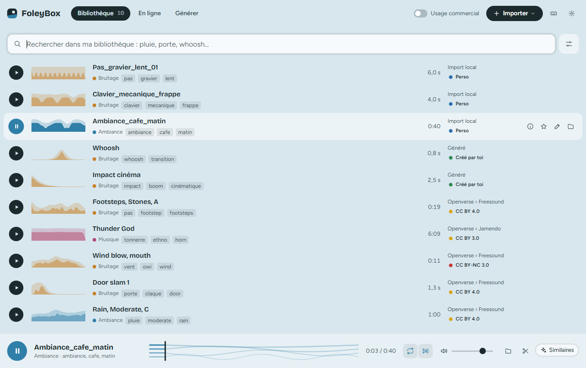
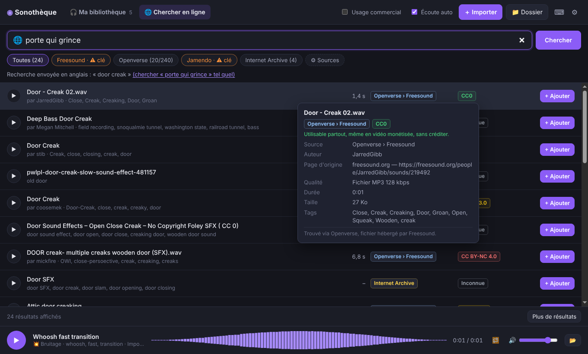
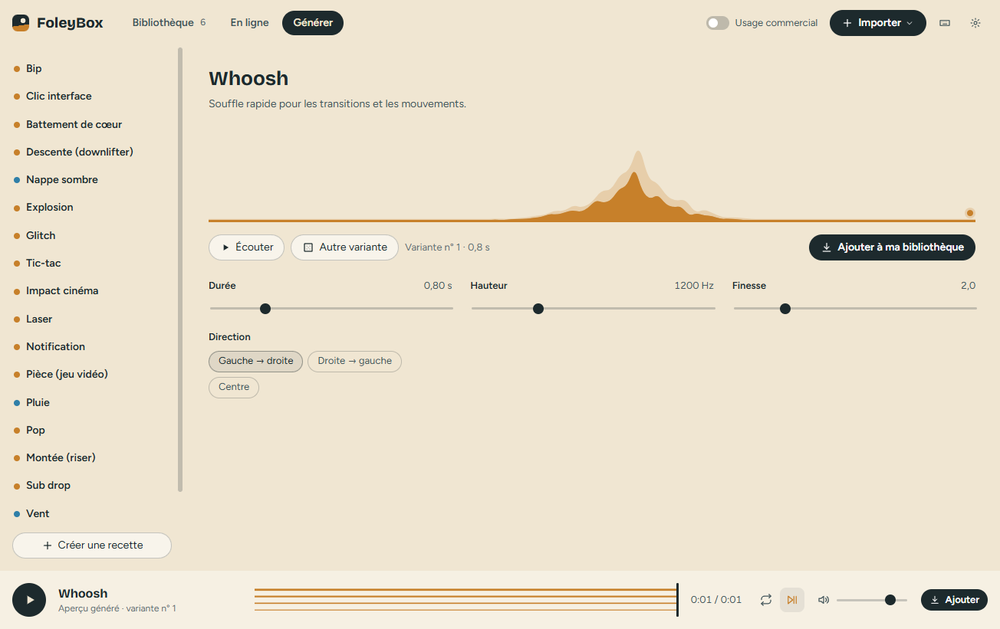
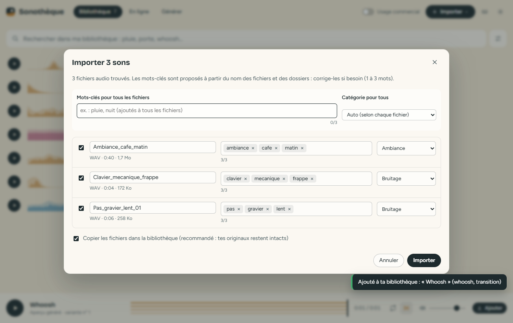
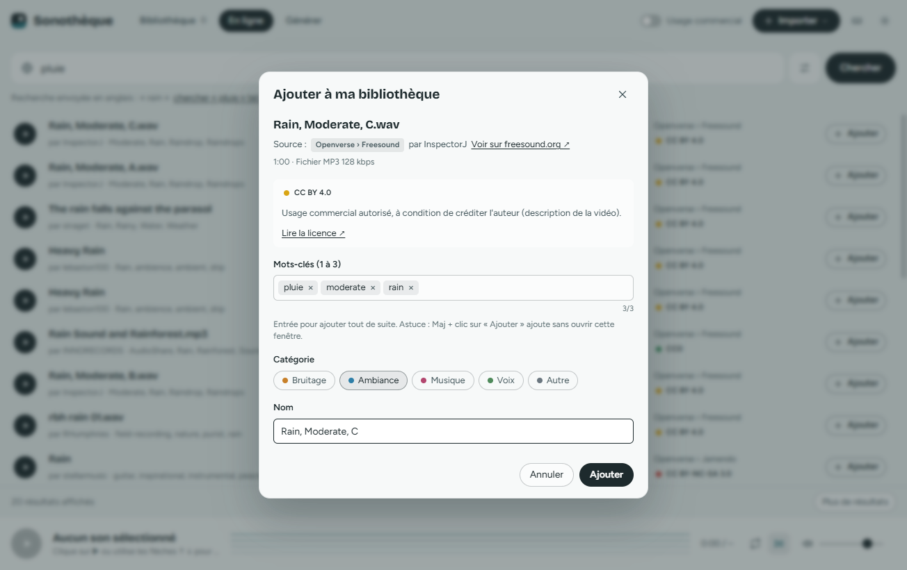

# FoleyBox

Ta banque de sons perso pour le montage vidéo : bruitages, ambiances, musiques.

- **Tu stockes tes sons en local** dans un dossier de ton PC, rangés par catégorie.
- **Tu les retrouves en 1 à 3 mots-clés**, en français ou en anglais : « pluie » trouve aussi un son tagué « rain ».
- **L'appli écoute tes sons pour toi** : un modèle de reconnaissance, qui tourne sur ton PC sans rien envoyer, repère ce qu'on entend dans chaque son (pluie, porte, pas, chien…). Un fichier nommé `AUDIO_0012.wav` devient trouvable, et le bouton « Similaires » du lecteur affiche les sons de ta bibliothèque qui ressemblent à celui que tu écoutes.
- **Tu les écoutes directement** : forme d'onde, boucle, et lecture automatique en naviguant avec ↑ ↓.
- **Tu les glisses dans ta timeline** Premiere Pro ou DaVinci Resolve : il suffit de glisser la ligne.
- **Tu n'en gardes qu'un passage** : le bouton ciseaux du lecteur ouvre le tracé du son, tu choisis l'extrait à la souris et tu le glisses seul dans ta timeline.
- **Tu cherches de nouveaux sons sur internet** dans 5 sources à la fois (Freesound, Openverse, Jamendo, Internet Archive, BBC Sound Effects). Tu les écoutes avant de les télécharger et tu les ajoutes en un clic, avec 1 à 3 mots-clés.
- **Tu génères tes propres sons avec du code** (onglet « Générer ») : whoosh, impacts, montées, clics, bips, lasers, vent, pluie… Tu règles avec des curseurs, tu écoutes et tu ajoutes. C'est gratuit, sans compte, et libre de droits. Claude ou ChatGPT peuvent t'écrire de nouvelles « recettes » de sons.
- **La source et la licence sont toujours visibles** sur chaque son, et une fiche complète s'ouvre depuis le bouton « infos » de la ligne : auteur, page d'origine, ce que la licence autorise.
- **Filtre « Usage commercial »** pour tes vidéos monétisées ou tes clients. Le bouton « Copier les crédits » prépare le texte à coller dans la description de la vidéo.





---

## Installer et lancer (Windows)

### Installer l'application

1. Récupère **`FoleyBox-Setup-<version>.exe`** : dans le dossier `dist/` du PC qui l'a fabriqué (copie-le sur une clé USB ou dans un cloud), ou dans les **Releases** du dépôt GitHub (voir plus bas).
2. Double-clique dessus et suis l'assistant. Aucun droit administrateur n'est demandé : l'appli s'installe pour ton compte Windows, dans `%LOCALAPPDATA%\Programs\foleybox`.
   - Si Windows affiche « Windows a protégé votre ordinateur » : « Informations complémentaires » → « Exécuter quand même ». Ce message s'affiche parce que l'installateur n'est pas signé numériquement : c'est normal pour un logiciel perso.
3. FoleyBox apparaît sur le Bureau et dans le menu Démarrer. Pour la désinstaller : Paramètres → Applications → FoleyBox.

Variante sans installation : **`FoleyBox-Portable-<version>.exe`** se lance directement, par exemple depuis une clé USB.

Ta bibliothèque (`Musique\FoleyBox`) et tes réglages (`%APPDATA%\FoleyBox`) sont conservés lors d'une mise à jour ou d'une désinstallation. Si quelque chose ne va pas, les erreurs sont enregistrées dans `%APPDATA%\FoleyBox\erreurs.log`.

Si tu utilisais l'appli sous son ancien nom, « Sonothèque », rien ne bouge : elle garde ton dossier de réglages et ta bibliothèque d'origine, et le nouvel installateur remplace l'ancienne version.

### Modifier le code et refabriquer l'installateur

Sur n'importe quel PC avec **Node.js** (version « LTS », https://nodejs.org) et **Git** :

```
git clone https://github.com/WqlkyHub/Service-Bridge.git
cd Service-Bridge/sonotheque
npm install
npm start
```

`npm start` lance l'appli depuis le code, pour essayer tes modifications. Le premier lancement télécharge le moteur Electron (environ 120 Mo, une seule fois). Une fois satisfait :

```
npm test
npm run dist
```

Le nouvel installateur et la version portable arrivent dans `dist/`. Pour une nouvelle version, augmente d'abord `"version"` dans `package.json` : l'installateur remplacera proprement l'ancienne version.

L'icône (`build/icon.png`) est dessinée par `outils/generer-icone.cjs` : modifie les couleurs ou les barres dans ce fichier, puis lance `node outils/generer-icone.cjs`.

### Fabrication automatique sur GitHub

Le fichier `.github/workflows/foleybox-windows.yml` (à la racine du dépôt) fabrique l'installateur sur les serveurs de GitHub, sans rien installer chez toi :

- **à la main** : onglet **Actions** → « FoleyBox : installateur Windows » → **Run workflow**. Les `.exe` sont ensuite téléchargeables en bas de la page de l'exécution (« Artifacts ») ;
- **en publiant une version** : crée un tag `foleybox-v0.4.0` (même numéro que dans `package.json`). Une **Release** est créée avec les deux `.exe` à télécharger.

---

## Premiers pas

1. **Importer tes sons existants** : glisse tes fichiers ou dossiers dans la fenêtre (ou bouton « Importer » en haut à droite : des fichiers ou un dossier entier).
   - L'appli propose des mots-clés à partir des noms de fichiers et de dossiers (`DoorSlam_Heavy_01.wav` → door, slam, heavy). Tu corriges si besoin.
   - Le champ « Mots-clés pour tous » ajoute les mêmes mots à tout un lot.
   - Par défaut, les fichiers sont **copiés** dans la bibliothèque : tes originaux ne bougent pas.
   - Les doublons sont détectés.
2. **Chercher** : tape 1 à 3 mots, les résultats s'affichent pendant que tu tapes. ↑ ↓ pour écouter, Entrée pour rejouer.
3. **Utiliser un son** : glisse la ligne dans Premiere Pro ou DaVinci Resolve. Avec Ctrl+clic ou Maj+clic, tu peux en glisser plusieurs d'un coup.
4. **Trouver en ligne** : onglet « En ligne ». Ta recherche est traduite en anglais automatiquement (« porte qui grince » → « door creak »).
   - ▶ pour écouter l'aperçu.
   - « + Ajouter » : tu choisis 1 à 3 mots-clés, Entrée, et c'est téléchargé.
   - Maj + clic sur « + Ajouter » : ajout direct avec les mots-clés proposés.

5. **Générer** : onglet « Générer ».
   - Choisis une recette à gauche et règle les curseurs : le son est refait et rejoué à chaque réglage.
   - « Autre variante » donne un autre tirage aléatoire avec les mêmes réglages.
   - « Ajouter à ma bibliothèque » : 1 à 3 mots-clés et c'est rangé. La licence est « Créé par toi », utilisable partout.

Raccourcis : bouton ⌨ en haut à droite.

| Import avec mots-clés proposés | Ajout d'un son trouvé en ligne |
|---|---|
|  |  |

---

## Clés gratuites (Freesound et Jamendo)

Openverse, Internet Archive et BBC Sound Effects marchent sans rien faire. Attention : les sons de la BBC sont réservés à un usage non commercial (pastille rouge), le filtre « Usage commercial » les masque. Pour avoir beaucoup plus de bruitages (Freesound) et des musiques complètes (Jamendo), crée deux clés gratuites, puis colle-les dans ⚙ Réglages :

| Source | Où | Quoi copier |
|---|---|---|
| **Freesound** | Crée un compte sur freesound.org, puis https://freesound.org/apiv2/apply | « Client secret/Api key » et « Client id » |
| **Jamendo** | https://devportal.jamendo.com → créer une application | « Client ID » |

**Freesound, qualité originale :** sans connexion, Freesound fournit un aperçu MP3 de bonne qualité. Dans les Réglages, clique « Connecter mon compte Freesound » pour télécharger les fichiers **originaux** (WAV/FLAC). La connexion se fait dans une petite fenêtre Freesound.

Tes clés sont chiffrées sur ton PC (coffre de Windows) et ne sont envoyées qu'à la source concernée.

---

## Générer des sons avec Claude ou ChatGPT

FoleyBox fabrique des sons avec du code : ce sont des **recettes**, de petits programmes qui décrivent un son. 18 recettes sont incluses. Tu peux en créer autant que tu veux avec ton IA habituelle, **sans connecter ton compte** :

1. Onglet « Générer » → **« Consigne pour Claude / ChatGPT »** : un mode d'emploi est copié.
2. Colle-le dans Claude (claude.ai ou Claude Code) ou ChatGPT, et décris ton son (« un vaisseau spatial qui passe au loin »).
3. Copie le code de la réponse → **« Coller une recette »** → *Tester* → *Enregistrer*.
4. Le son ne te plaît pas ? Demande à l'IA de le corriger (« plus grave », « plus long ») et recolle le code. En cas d'erreur, l'appli affiche un message à recopier à l'IA.

Tes recettes sont rangées dans `FoleyBox\Recettes\` (fichiers `.recette`). Elles tournent dans une fenêtre invisible et isolée : pas d'accès à tes fichiers ni à internet. Une recette qui boucle à l'infini est arrêtée au bout de 30 secondes.

> Pourquoi pas un bouton « Se connecter à Claude / ChatGPT » ? Claude et Codex écrivent du texte et du code, mais ne produisent pas de son eux-mêmes. Et Anthropic n'autorise pas une autre application à utiliser la connexion d'un abonnement Claude. Passer par ta conversation reste gratuit, autorisé et tout aussi rapide.
>
> Les sons de synthèse sont parfaits pour les transitions, l'interface, la science-fiction, les impacts et les ambiances abstraites. Pour un son réaliste (aboiement, voix, vraie porte), la recherche en ligne reste plus adaptée.

---

## Licences : ce que veulent dire les couleurs

| Pastille | Signification |
|---|---|
| 🟢 **CC0 / Domaine public / Créé par toi** | Utilisable partout, même en vidéo monétisée, sans créditer. |
| 🟡 **CC BY / CC BY-SA** | Usage commercial OK, **à condition de créditer l'auteur** (description de la vidéo). |
| 🟠 **CC BY-ND** | Usage commercial OK en créditant, mais **sans modifier** le son. |
| 🔴 **NC (non commercial)** | **Interdit** en vidéo monétisée ou pour un client. Usage perso uniquement. |
| ⚪ **Inconnue** | Licence non précisée : vérifie sur la page d'origine avant usage. |
| 🔵 **Perso** | Fichier importé depuis ton PC : tu connais ses droits. |

Le bouton **Usage commercial** (en haut) masque les 🔴 et les ⚪. Pour les 🟡, sélectionne les sons utilisés puis « 📋 Copier les crédits » (bibliothèque) : le texte est prêt à coller.

> L'appli t'aide, mais la licence affichée est celle déclarée par la source. Pour un projet client important, un clic sur « Page d'origine » permet de vérifier.

---

## Où sont mes fichiers ?

Par défaut dans `Musique\FoleyBox` (modifiable dans les Réglages) :

```
FoleyBox\
  Sons\Bruitage\…      Sons\Ambiance\…      Sons\Musique\…      Sons\Voix\…
  Recettes\                        ← tes recettes de sons (.recette)
  sonotheque-bibliotheque.json     ← mots-clés, sources, licences
  .sauvegardes\                    ← copie de l'index chaque jour (7 jours)
```

Au premier lancement, une fenêtre de bienvenue te demande où ranger ta bibliothèque. Tu peux déplacer tout le dossier (disque externe, autre PC) : rien ne casse, il suffit de le rechoisir dans les Réglages.

Si tu choisis un **autre dossier** dans les Réglages, les sons déjà enregistrés restent dans ta bibliothèque, là où ils sont : seuls les nouveaux sons vont dans le nouveau dossier. Chaque ligne indique l'emplacement d'un son rangé ailleurs, et signale « Fichier introuvable » si le fichier a disparu (disque débranché, fichier déplacé).

---

## Pour les développeurs

- Stack : **Electron** (Windows, macOS, Linux) et JavaScript sans framework ni étape de build. La seule dépendance d'exécution est `music-metadata` (lecture des durées et des tags audio).
- `npm start` lance l'appli. `npm test` lance les tests (bibliothèque, import, téléchargement, sources, recherche, licences).
- Structure :
  ```
  src/main/       processus principal : disque, réseau, sources en ligne, téléchargements
  src/main/sources/   une source = un fichier (freesound, openverse, jamendo, archive)
  src/preload/    pont sécurisé entre l'interface et le processus principal
  src/renderer/   interface (HTML/CSS/JS)
  src/shared/     code commun : mots-clés, dictionnaire FR↔EN, licences, recherche, types de médias
  src/synth/      moteur de génération (fenêtre isolée) + consigne pour les IA
  src/ia/         reconnaissance des sons (fenêtre isolée) ; le modèle est dans src/ia/modele/
  src/recipes/    recettes de sons intégrées (.recette)
  ```
- **Ajouter une source** : un fichier dans `src/main/sources/` qui exporte `{ id, label, kinds, search, download }`, puis une ligne dans `sources/index.mjs`.
- **Enrichir le dictionnaire FR → EN** : `src/shared/synonyms.mjs`, une entrée par mot.
- **Reconnaissance des sons** : le modèle YAMNet (Google) et TensorFlow.js, tous deux sous licence Apache 2.0, sont téléchargés par `npm install` dans `src/ia/modele/` (17 Mo, hors du dépôt Git, empreintes vérifiées). `npm run ia` relance ce téléchargement. Sans eux, l'appli fonctionne, sans mots-clés automatiques ni sons similaires. L'option se coupe dans Réglages → Bibliothèque.
- **Ancien nom** : l'appli s'appelait « Sonothèque ». Le dossier du code (`sonotheque/`), l'identifiant `fr.sonotheque.app` et le fichier d'index gardent ce nom exprès : c'est ce qui permet au nouvel installateur de remplacer une ancienne version et de relire les bibliothèques existantes.
- **La suite** : voir [ROADMAP.md](ROADMAP.md).
- Sécurité : `contextIsolation` et `sandbox` activés, CSP stricte, aucun `innerHTML` avec des données venant d'internet. Les téléchargements se font uniquement en HTTPS, sont limités à 1 Go et vérifiés comme vrais fichiers audio. Les clés sont chiffrées avec `safeStorage`.
